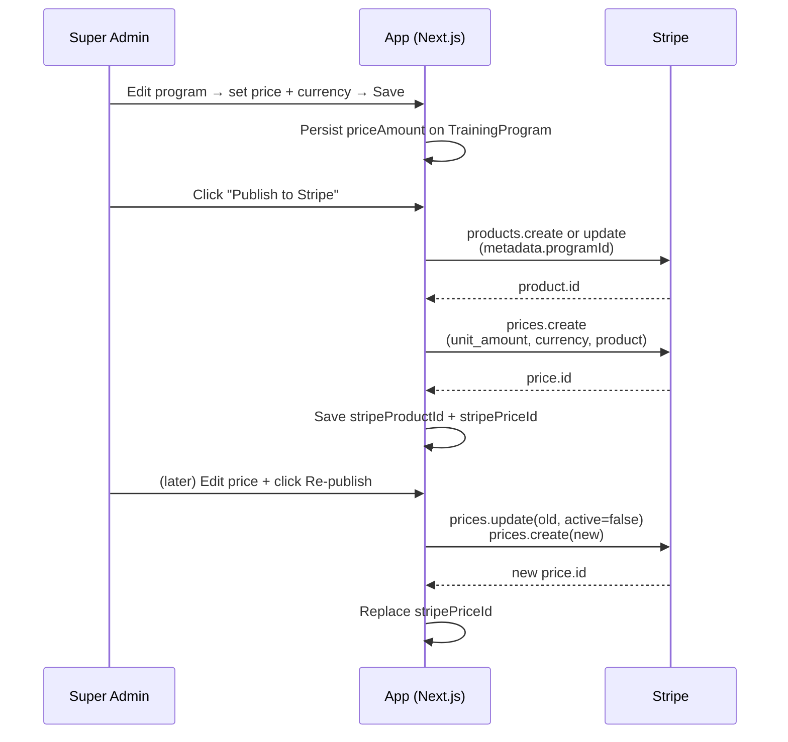
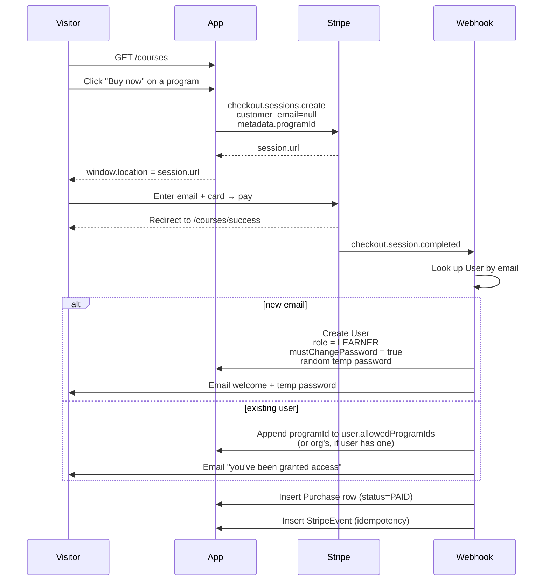
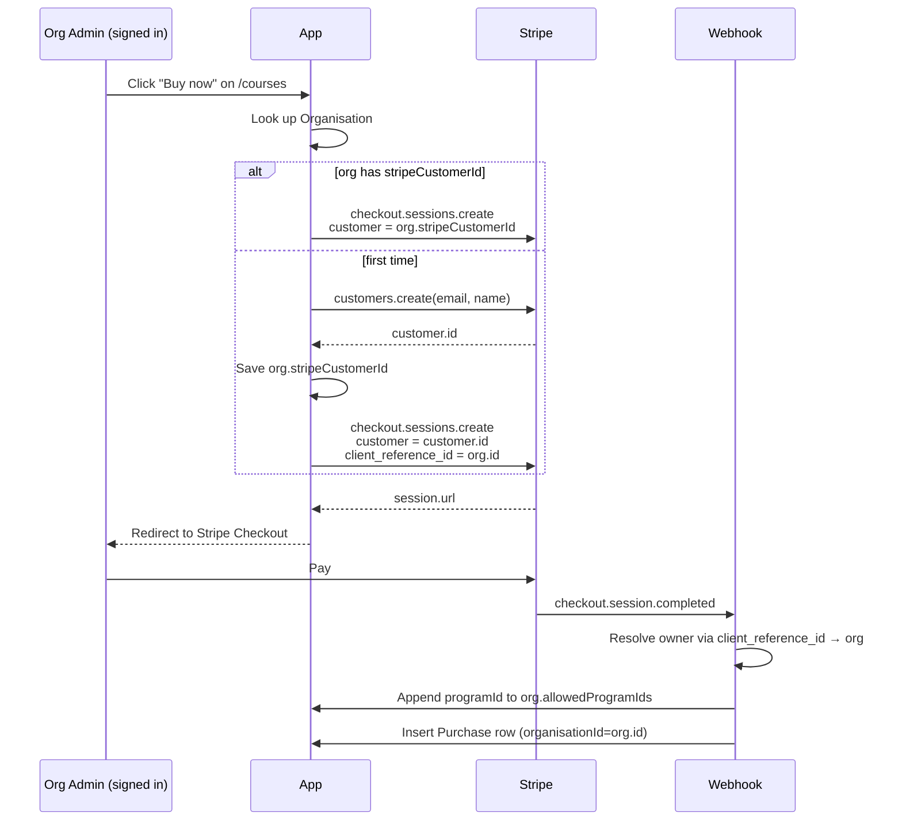
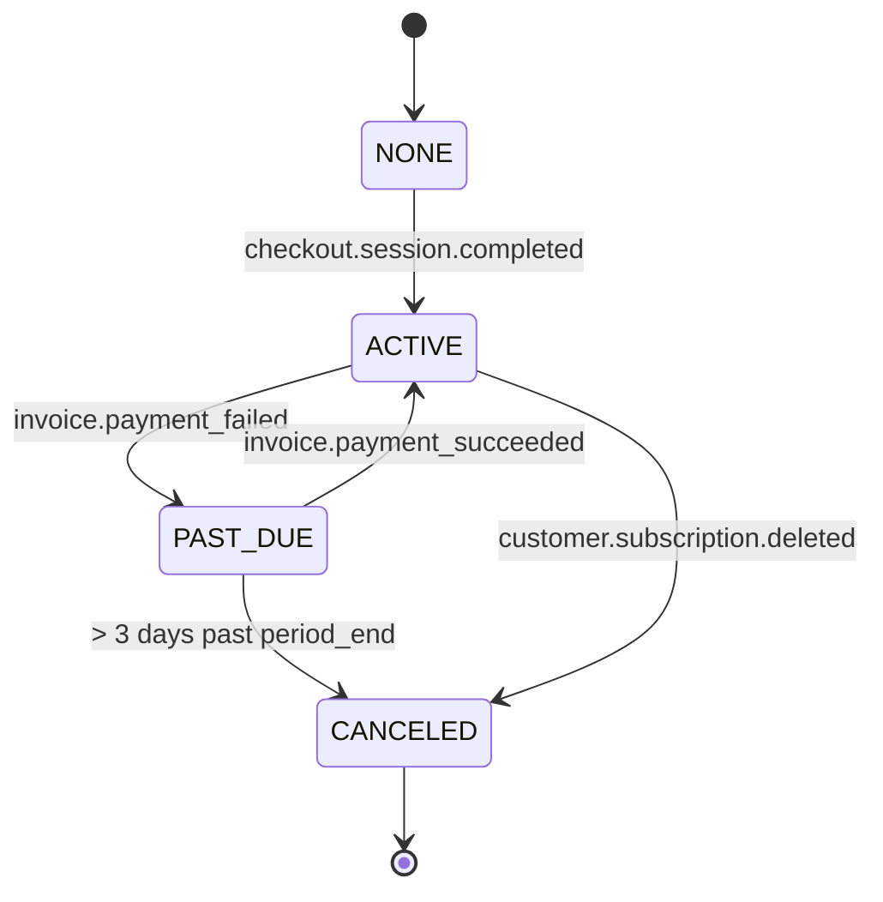
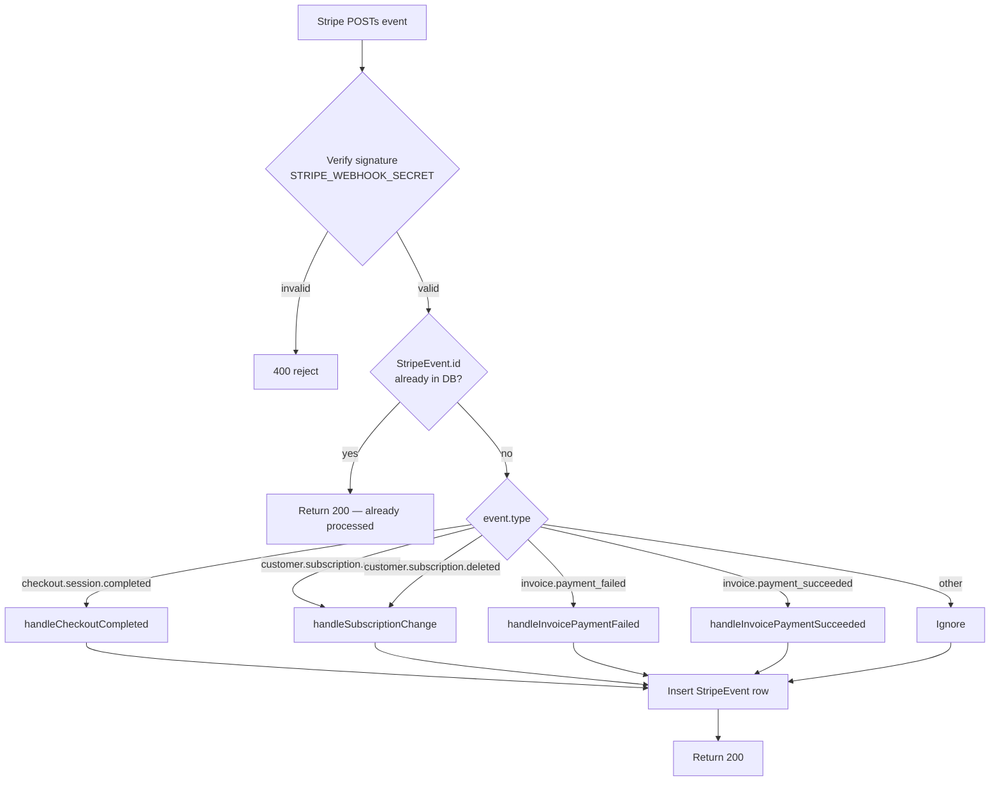

# Stripe — workflows and architecture

This document is the canonical reference for everything Stripe-related in
`asd-training-app`. Updated whenever the payment surface changes.

## Contents
1. [What the platform sells](#what-the-platform-sells)
2. [Architecture at a glance](#architecture-at-a-glance)
3. [Per-program default role](#per-program-default-role)
4. [Workflow: publishing a program to Stripe](#workflow-publishing-a-program-to-stripe)
5. [Workflow: anonymous paid checkout (B2C)](#workflow-anonymous-paid-checkout-b2c)
6. [Workflow: signed-in paid checkout (B2B)](#workflow-signed-in-paid-checkout-b2b)
7. [Workflow: free-claim flow (no Stripe)](#workflow-free-claim-flow-no-stripe)
8. [Workflow: subscription lifecycle](#workflow-subscription-lifecycle)
9. [Webhook event handling](#webhook-event-handling)
10. [Refunds](#refunds)
11. [Going live (sandbox → live)](#going-live-sandbox--live)
12. [Local development with the Stripe CLI](#local-development-with-the-stripe-cli)
13. [Debugging common failures](#debugging-common-failures)
14. [Environment variables](#environment-variables)
15. [File index](#file-index)

---

## What the platform sells

| Product type | What it is | Examples |
|---|---|---|
| **One-off program** | Pay once, get permanent access to a single training program | Autism in the Workplace, Careers CPD Training |
| **All-Access subscription** | Yearly recurring fee → unlimited access to every approved program | "All-Access" yearly tier |
| **Free program** | Listed on `/courses` for free claim — no Stripe involvement | A program with `priceAmount = 0` and `purchasable = true` |

Programs are flagged purchasable in the super-admin training UI. Only
`status = APPROVED && active = true && purchasable = true` programs appear
on `/courses`.

---

## Architecture at a glance

```
TrainingProgram                     Stripe (sandbox or live)
├─ id                  ←────────┐   ├─ Product
├─ name                          │   │   metadata.programId = TrainingProgram.id
├─ priceAmount (pence)           │   ├─ Price (immutable; new one on price change)
├─ stripeProductId    ───────────┘   │
├─ stripePriceId     ────────────┐   │
├─ purchasable                    │   │
└─ ...                             │   │
                                   │   ▼
                                   │   Checkout Session
                                   │   metadata.programId
                                   │   metadata.mode = 'purchase' | 'subscription'
                                   │
Organisation                       │
├─ stripeCustomerId  ←───────────┐ │
├─ stripeSubscriptionId           │ │
├─ subscriptionStatus             │ │
└─ allowedProgramIds[] ←──────────┼─┘  (program added on paid purchase)
                                  │
User (anonymous-checkout buyer)   │
├─ stripeCustomerId  ←────────────┘
├─ stripeSubscriptionId
├─ subscriptionStatus
└─ allowedProgramIds[]

Purchase (audit row)
├─ programId
├─ stripeCheckoutSessionId   (unique; "free_<hex>" for free claims)
├─ stripePaymentIntentId
├─ amount, currency, status
├─ userId | organisationId   (one of, never both)
└─ createdAt

StripeEvent (idempotency ledger)
├─ id   (Stripe event id, primary key)
└─ type
```

Two ownership models live side-by-side:

- **Org-owned** — user belongs to an `Organisation`; subscriptions and
  purchases attach to the org and propagate to every member via
  `allowedProgramIds`.
- **User-owned** — anonymous buyer with no org; subscription/purchase
  attaches directly to the `User` (their personal `allowedProgramIds`).
  These users have `organisationId = null`.

---

## Role assigned on self-serve sign-up

Self-serve flows (free-claim and anonymous Stripe checkout) create the new
account with the single `LEARNER` role. There is nothing to configure.

The `TrainingProgram.defaultLeafRole` column that used to drive this was
dropped in July 2026 along with the per-audience roles it selected between.
What a user can then see comes from `User.allowedProgramIds` — the purchased
or claimed programme is added there at account creation.

Read by:
- `lib/account-provisioning.ts` `grantFreeAccess()`
- `lib/stripe-webhook.ts` `provisionIndividualUser()`

---

## Workflow: publishing a program to Stripe

Programs only appear on Stripe (and accept paid checkout) once an admin
explicitly publishes them.



**Unpublish from Stripe** archives the price + product on Stripe (Stripe
never deletes either) and clears `stripePriceId` / `stripeProductId` on
our side, plus flips `purchasable = false` so the program drops off
`/courses`.

**Code:** [`app/api/super-admin/training/programs/[programId]/stripe-publish/route.ts`](../app/api/super-admin/training/programs/[programId]/stripe-publish/route.ts)

---

## Workflow: anonymous paid checkout (B2C)



**Visitor's experience:** click Buy → pay on Stripe → land on `/courses/success` →
email arrives with sign-in details a few seconds later (webhook is
asynchronous).

**Code paths:**
- Checkout entry: [`app/api/checkout/session/route.ts`](../app/api/checkout/session/route.ts)
- Webhook: [`app/api/stripe/webhook/route.ts`](../app/api/stripe/webhook/route.ts) → [`lib/stripe-webhook.ts`](../lib/stripe-webhook.ts)
- Provisioning: `provisionIndividualUser()` in `lib/stripe-webhook.ts`

---

## Workflow: signed-in paid checkout (B2B)

When the buyer is signed in and belongs to an organisation, the checkout
attaches to the org rather than provisioning a new user.



The org's existing members all gain access immediately (the
`allowedProgramIds` array is read by `lib/modules.ts:getOrgPrograms()`
on every session refresh).

---

## Workflow: free-claim flow (no Stripe)

Programs with `priceAmount = 0 && purchasable = true` are claimable for
free without ever touching Stripe.

```mermaid
sequenceDiagram
  participant Visitor
  participant App as App (free-claim API)
  participant DB as Database
  participant Email as Resend

  Visitor->>App: GET /courses → see "Free" badge
  Visitor->>App: Click "Get free access"
  alt anonymous
    App-->>Visitor: Show modal asking for email + name
    Visitor->>App: POST /api/courses/free-claim
  else signed-in
    App->>App: POST /api/courses/free-claim<br/>(uses session email; no modal)
  end
  App->>DB: Look up program (must be APPROVED + active +<br/>purchasable + priceAmount=0)
  App->>DB: Look up User by email
  alt new email
    App->>DB: Create User<br/>role = LEARNER<br/>mustChangePassword = true<br/>allowedProgramIds = [programId]
    App->>Email: Welcome + temp password
  else existing user (no org)
    App->>DB: Append programId to user.allowedProgramIds
    App->>DB: Mint PasswordResetToken (1h)
    App->>Email: "Access granted" + Set-my-password link
  else existing user (in org)
    App->>DB: Append programId to org.allowedProgramIds<br/>(so colleagues benefit, not the individual)
    App->>DB: Mint PasswordResetToken (1h)
    App->>Email: "Access granted" + Set-my-password link
  end
  App->>DB: Insert Purchase row<br/>amount=0, status=PAID,<br/>stripeCheckoutSessionId="free_<hex>"
  App-->>Visitor: { ok: true, message: "We've sent you sign-in details" }
```

**Why it still creates a Purchase row:** keeps reporting and audit
consistent with paid flows, and the unique synthetic
`stripeCheckoutSessionId` prevents double-grants if the same email
re-claims (idempotency boundary).

**Code:**
- API: [`app/api/courses/free-claim/route.ts`](../app/api/courses/free-claim/route.ts)
- Logic: [`lib/account-provisioning.ts`](../lib/account-provisioning.ts) `grantFreeAccess()`
- UI: [`components/courses/program-card.tsx`](../components/courses/program-card.tsx)

---

## Workflow: subscription lifecycle

Subscriptions are managed entirely on Stripe. We mirror state via
webhook events.

| Stripe status | Our `subscriptionStatus` | Has access? |
|---|---|---|
| `active` | `ACTIVE` | yes |
| `trialing` | `TRIALING` | yes |
| `past_due` | `PAST_DUE` | yes, **3-day grace** from `subscriptionCurrentPeriodEnd` |
| `canceled` | `CANCELED` | no — revoked immediately |
| `unpaid` | `UNPAID` | no |
| `incomplete` | `NONE` | no |

Grace policy: a `PAST_DUE` subscription within 3 days of period end keeps
working so a single failed-card retry doesn't kick a learner out
mid-lesson. Beyond grace → revoke.



Owned by either an `Organisation` (org-wide subscription) or a `User`
(individual). Resolution lives in `lib/stripe-webhook.ts`
`resolveOwnerFromSubscriptionId()`.

**Self-service billing portal** — users hit `POST /api/billing/portal`
to get a Stripe-hosted page where they can update card, cancel, or
download invoices.

---

## Webhook event handling

Endpoint: `POST /api/stripe/webhook`



**Idempotency** — every successfully-processed event id is written to
the `StripeEvent` table. Stripe retries on timeouts; replays are no-ops.

**Subscribed event types** (set in Stripe dashboard or via CLI):
- `checkout.session.completed`
- `customer.subscription.updated`
- `customer.subscription.deleted`
- `invoice.payment_failed`
- `invoice.payment_succeeded`

Anything else is silently ignored — handlers are added on demand.

---

## Refunds

**Currently issued from the Stripe dashboard manually.** The app does
not expose a refund button. Refunding does not automatically remove
program access — that has to be done by the admin via the user/org edit
UI (remove from `allowedProgramIds`).

If/when refunds become routine we'd:
1. Add `refund` to the webhook handler set (`charge.refunded`)
2. Update the `Purchase.status` to `REFUNDED`
3. Optionally auto-revoke access (judgement call — partial refunds shouldn't)

---

## Going live (sandbox → live)

The app currently runs on Stripe **test/sandbox** keys. To switch to
live:

1. Activate the charity's Stripe account (verification, bank account, tax info)
2. In Stripe dashboard, create live versions of:
   - The All-Access yearly Product + Price
   - Any per-program Products published in test (super-admin "Publish to Stripe" will create new ones in live)
3. In Vercel env (production scope) replace:
   - `STRIPE_SECRET_KEY` → `sk_live_...`
   - `STRIPE_PUBLISHABLE_KEY` → `pk_live_...`
   - `STRIPE_SUBSCRIPTION_PRICE_YEARLY` → live yearly price id
4. Register a **live** webhook endpoint at
   `https://asd-training-app-v2.vercel.app/api/stripe/webhook`
   subscribed to the same event types listed above. Take its signing
   secret and set `STRIPE_WEBHOOK_SECRET` in Vercel prod env.
5. Republish each purchasable program from the super-admin UI — this
   creates fresh live Products/Prices and stores their ids on
   `TrainingProgram.stripeProductId/stripePriceId`.
6. Smoke test:
   - Buy a £0.50 test program with a real card
   - Confirm webhook fires + access granted + email arrives
   - Issue a refund from the Stripe dashboard
7. Flip `ENABLE_PAYMENTS="true"` in Vercel prod env if not already.

---

## Local development with the Stripe CLI

The Stripe CLI tunnels webhook events from sandbox into your localhost
so you can test the full flow end-to-end.

```bash
# install once
brew install stripe/stripe-cli/stripe   # macOS
# or: scoop install stripe              # Windows

stripe login                            # one-time auth

# in a separate terminal alongside `npm run dev`
stripe listen --forward-to localhost:3000/api/stripe/webhook
```

`stripe listen` prints a webhook signing secret on startup
(`whsec_...`). Set it as `STRIPE_WEBHOOK_SECRET` in `.env.local` for the
duration of the dev session.

**Trigger events without a real checkout:**
```bash
stripe trigger checkout.session.completed
stripe trigger invoice.payment_succeeded
stripe trigger customer.subscription.deleted
```

**Test cards** (Stripe sandbox):
| Card | Behaviour |
|---|---|
| `4242 4242 4242 4242` | Always succeeds |
| `4000 0000 0000 9995` | Always declines (insufficient funds) |
| `4000 0027 6000 3184` | Requires 3D Secure auth |

Any future expiry, any CVC, any postcode.

---

## Debugging common failures

### "Webhook returned 200 but nothing happened in the DB"
Check the `StripeEvent` table — if the event id is there, we already
processed it. Stripe replays are idempotent by design. Look at the
**original** webhook attempt in the Stripe dashboard's Events log.

### "Buyer paid but didn't get an email"
1. Check the `Purchase` table — was the row created? If yes, fulfilment
   ran; the issue is downstream (Resend).
2. Check Resend dashboard for the send. Common causes:
   - Free-tier `onboarding@resend.dev` only delivers to the
     account-verified email. To send to other recipients, verify a
     sending domain.
   - Spam folder.
3. Check `User.mustChangePassword` — if `true`, the welcome email
   should have included a temp password.

### "Webhook 400s with signature error"
`STRIPE_WEBHOOK_SECRET` doesn't match the endpoint that fired the
event. Each endpoint (test, live, plus the one the Stripe CLI
generates) has its own secret. The webhook route reads
`process.env.STRIPE_WEBHOOK_SECRET` at request time — restart `npm run
dev` after editing `.env.local`.

### "Anonymous buyer logged in, can't see the program"
1. Confirm `User.allowedProgramIds` includes the `programId`.
2. JWT is cached for the session — they may need to sign out and back in.
3. Role is not the issue — every self-serve account is a `LEARNER`, and
   the sidebar renders one entry per programme in `allowedProgramIds`.
   If the programme is missing from the sidebar, it is missing from
   that array.

### "I made a checkout session and it 502'd"
Check the server logs (Vercel dashboard → Functions → logs). Common
causes:
- `STRIPE_SECRET_KEY` invalid/missing
- Program has no `stripePriceId` (admin hasn't clicked Publish to Stripe)
- Trying to checkout a program with `purchasable = false`

### "Subscription says PAST_DUE but Stripe shows ACTIVE"
Webhook delivery failed. Look at Stripe → Webhooks → endpoint →
"Recent deliveries". Failed deliveries are retried for 3 days; you can
manually replay one.

---

## Environment variables

| Var | Required | Notes |
|---|---|---|
| `STRIPE_SECRET_KEY` | yes | `sk_test_...` (sandbox) or `sk_live_...` (live) |
| `STRIPE_PUBLISHABLE_KEY` | yes | `pk_test_...` / `pk_live_...` |
| `STRIPE_WEBHOOK_SECRET` | yes | `whsec_...`. Different per endpoint (sandbox / Stripe CLI / live) |
| `STRIPE_SUBSCRIPTION_PRICE_YEARLY` | yes for subs | Stripe Price id for All-Access yearly tier |
| `ENABLE_PAYMENTS` | yes | `"true"` to expose `/courses` and accept checkout. `"false"` (or unset) → 404s |
| `NEXTAUTH_URL` | yes | Used to build success/cancel/login URLs in checkout sessions and emails |
| `RESEND_API_KEY` | yes | For welcome / access-granted emails |

Sandbox-vs-live envelope: keep `sk_test_` + `whsec_` (test) wired up in
**preview** and **development** Vercel scopes; only **production** flips
to live keys when going live.

---

## File index

| Path | Role |
|---|---|
| [`prisma/schema.prisma`](../prisma/schema.prisma) | `TrainingProgram`, `Purchase`, `StripeEvent`, `Organisation` (Stripe fields), `User` (Stripe fields), `SubscriptionStatus` enum |
| [`lib/stripe.ts`](../lib/stripe.ts) | Singleton Stripe SDK client, env-var bindings, `requireStripe()` |
| [`lib/stripe-webhook.ts`](../lib/stripe-webhook.ts) | All webhook event handlers, owner resolution, subscription state mapping, anonymous user provisioning |
| [`lib/account-provisioning.ts`](../lib/account-provisioning.ts) | Free-claim user provisioning + welcome / access-granted email helpers |
| [`lib/email-templates/layout.ts`](../lib/email-templates/layout.ts) | Branded email shell (logo, card, button styles) — used by all transactional emails |
| [`lib/modules.ts`](../lib/modules.ts) | `getOrgPrograms()` — combines `allowedProgramIds` + active subscription + paid purchases |
| [`app/api/checkout/session/route.ts`](../app/api/checkout/session/route.ts) | POST endpoint that creates Stripe Checkout sessions for purchases + subscriptions |
| [`app/api/stripe/webhook/route.ts`](../app/api/stripe/webhook/route.ts) | Webhook entrypoint — verify signature, dispatch to `lib/stripe-webhook.ts` |
| [`app/api/courses/free-claim/route.ts`](../app/api/courses/free-claim/route.ts) | POST endpoint for free-program claims (no Stripe) |
| [`app/api/billing/portal/route.ts`](../app/api/billing/portal/route.ts) | Returns a Stripe Billing Portal URL for self-service plan management |
| [`app/api/super-admin/training/programs/[programId]/stripe-publish/route.ts`](../app/api/super-admin/training/programs/[programId]/stripe-publish/route.ts) | POST/DELETE — Publish program to Stripe, or unpublish |
| [`app/courses/page.tsx`](../app/courses/page.tsx) | Public catalogue — lists purchasable programs + All-Access subscription card |
| [`components/courses/program-card.tsx`](../components/courses/program-card.tsx) | Per-program card with Buy / Get free access button + free-claim modal |
| [`components/courses/subscription-card.tsx`](../components/courses/subscription-card.tsx) | All-Access subscription card |
| [`app/(super-admin)/super-admin/training/page.tsx`](<../app/(super-admin)/super-admin/training/page.tsx>) | Super-admin program editor — pricing, Publish/Unpublish, default-leaf-role dropdown |

---

*Last updated: 2026-04-29*
